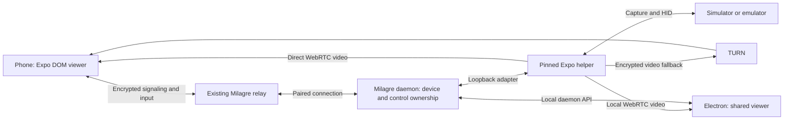

# Remote simulator viewing and control

Research completed October 5, 2026 (Toronto; October 6 UTC). Milagre checkout: `9e72cbf929b8279b3707f09eb936877e8f7def5b`.

Follow-up: [October 6 local validation results](remote-simulator-local-spike.md). Video and the bundled native WebView path passed local checks; startup input and typing still need investigation. Rotation requires orientation metadata in the receiver.

Recommend a pinned Expo Device Hub helper owned by Milagre's daemon, direct WebRTC video with TURN fallback, and signaling plus input through Milagre's existing encrypted relay. Share the browser viewer between Electron and an Expo DOM component on mobile. This is a credible OTA path, subject to verification in the installed TestFlight build.

This is a research recommendation, not an accepted implementation spec. No application code, dependencies, services, cloud configuration or builds were changed. Source, published packages and existing build records were inspected; playback, latency and packaged-host compatibility were not tested.

## What other products do

The original [T3 Code demo](https://x.com/ParthJadhav8/status/2106755380638609895) shows the desired interaction: view a Mac-hosted simulator on a phone and touch it directly. X blocked direct retrieval; the clip was retrieved through an alternate public metadata endpoint and inspected. The implementation claims below come from source and pull requests, not inference from the clip.

| Product | Evidence found | Lesson for Milagre |
| --- | --- | --- |
| T3 Code | Integrated mobile simulator viewer; Expo Device Hub capture; native WebView with shared browser code. The mobile implementation examined prefers MJPEG on iOS and handles one pointer. | Closest ADE precedent. Reuse its separation between host tools and authenticated client access. |
| Orca | Desktop iOS streaming through serve-sim/MJPEG and Android through scrcpy. No simulator viewer was verified in its mobile agent interface. | Its fixes show how renderer reloads and forgotten stream listeners can break an otherwise working viewer. |
| SimDeck Studio | Dedicated phone/tablet simulator client with WebRTC, device selection and controls; open-source host. | Closest reusable alternative backend; direct WebRTC is already practical in this category. |
| Mata | Dedicated iPhone/browser/Mac viewer. Advertises touch, multiple simulators and native H.265 streaming between Apple devices. | Useful product reference, but its proprietary native path is not an immediate Milagre integration. |
| Superset, Paseo, Happy | Remote agent access found; an equivalent local-simulator phone viewer was not verified. Superset's Limrun workflow uses cloud simulator links. | Remote terminal/chat access alone does not establish the desired feature. |

Sources: [T3 device architecture](https://github.com/pingdotgg/t3code/blob/3a9c1a6df1b71d8ba73d287be90443e8e874802f/docs/internals/devices.md), [T3 mobile viewer](https://github.com/pingdotgg/t3code/blob/3a9c1a6df1b71d8ba73d287be90443e8e874802f/apps/mobile/src/features/devices/DeviceStreamWebView.tsx), [Orca frame streaming](https://github.com/stablyai/orca/blob/059e81a106f675aa445bdce4a4e8a9ed56cfa9f1/src/main/ipc/emulator-frame-stream.ts), [SimDeck video guide](https://github.com/NativeScript/SimDeck/blob/82e61b304d771b717eb134c32c6802a88ffa783b/docs/guide/video.md), [SimDeck Studio listing](https://apps.apple.com/ca/app/simdeck-studio/id6770182703), [Mata](https://getmata.app/). The adjacent ADE finding is a search boundary, not proof those products cannot provide the feature.

T3's [initial mobile viewer PR](https://github.com/pingdotgg/t3code/pull/12531) reported taps/swipes reaching the helper but being ignored on the tested iOS 26.5 simulator; Android had not received an integration test there. Its [recovery PR](https://github.com/pingdotgg/t3code/pull/12639) fixed first-frame and reconnect problems but still recorded a cached-image freeze with a healthy helper. These are historical test reports, not a claim that current T3 remains broken. Milagre needs real input verification and capture health beyond an open socket.

## Backend choice

| Criterion | Expo Device Hub | SimDeck |
| --- | --- | --- |
| Artifacts inspected | `expo-device-hub@0.15.1`, `@expo/serve-sim@0.6.0` | `simdeck@0.2.0` |
| iOS host | Swift N-API addon, macOS 14+, arm64 | Separate native executable; arm64 and x64 artifacts |
| Video | Direct WebRTC; other HTTP/WebSocket formats also available | Direct WebRTC |
| Input | Separate HID WebSocket; iOS rejects WebRTC datachannels | Control datachannels attached to peer connection |
| Android | adb/scrcpy 4.0 capture/control | Emulator gRPC/shared-video capture; benefits from owning emulator startup |

Choose Expo first because the separate input path fits daemon-enforced control ownership, and adb/scrcpy suits emulators already running outside Milagre. This Mac is arm64. If Intel Mac support is a release requirement, Expo's inspected iOS artifact cannot cover it; reconsider SimDeck or provide an explicit platform limitation.

Expo uses the `LiveKitWebRTC` native library to create peer connections. It does not require LiveKit Cloud, rooms or an SFU. Its iOS offer endpoint accepts `{type: "offer", sdp, sessionId, codec?, iceServers?}` and returns `{type, sdp}`. Android configures ICE on the host rather than accepting offer-supplied ICE, so one Milagre adapter must hide these differences. Sources: [native publisher](https://github.com/expo/expo-device-hub/blob/4822dc0448bfdc99c73b080957e54d5c7a6c2851/packages/serve-sim/packages/serve-sim/Sources/SimNative/WebRTCPublisher.swift#L1108), [iOS request handler](https://github.com/expo/expo-device-hub/blob/4822dc0448bfdc99c73b080957e54d5c7a6c2851/packages/serve-sim/packages/serve-sim/src/device-session.ts#L933), [Android source](https://github.com/expo/expo-device-hub/tree/4822dc0448bfdc99c73b080957e54d5c7a6c2851/packages/serve-emu).

The iOS HID protocol supports one touch and exactly two simultaneous touches, with begin/move/end phases. It is not an arbitrary N-finger protocol. Current source cleans up pressed keys and gestures on disconnect. The published `0.15.1` bundle contains multi-touch cleanup absent from T3's `0.12.0` bundle; behavior must be checked against the selected artifact. Sources: [input and cleanup](https://github.com/expo/expo-device-hub/blob/4822dc0448bfdc99c73b080957e54d5c7a6c2851/packages/serve-sim/packages/serve-sim/src/device-session.ts#L1087), [published 0.15.1 metadata](https://registry.npmjs.org/expo-device-hub/0.15.1), [published 0.12.0 metadata](https://registry.npmjs.org/expo-device-hub/0.12.0).

SimDeck remains the second candidate. Its peer connection exposes input directly, so a viewer/controller distinction requires a server-side gate or adapter changes. Hiding buttons is insufficient. Its published macOS artifact also contains x264 encoder symbols, consistent with static inclusion; record the bundled component licenses before redistribution. Sources: [peer/control implementation](https://github.com/NativeScript/SimDeck/blob/82e61b304d771b717eb134c32c6802a88ffa783b/packages/server/src/transport/webrtc.rs#L548), [native build configuration](https://github.com/NativeScript/SimDeck/blob/82e61b304d771b717eb134c32c6802a88ffa783b/packages/server/build.rs).

## Transport and phone viewer

Use WebRTC for compressed video. It supplies browser decoding, congestion handling and NAT traversal. Keep video out of the React Native bridge and Milagre's JSON relay. Relay only SDP/ICE negotiation and small typed input messages through the existing authenticated phone connection.

| Alternative | Why it is not the default |
| --- | --- |
| JPEG frames into React Native `Image` | Repeated base64, encryption, decode and rendering work; suitable as a low-rate fallback with one pending latest frame. |
| MJPEG in a DOM viewer | Milagre's current HTTP relay fully buffers responses. An endless multipart body cannot pass through unchanged. |
| H.264/WebCodecs over WebSocket | Requires custom framing, decoder setup, keyframe recovery and backpressure. TCP stalls can accumulate stale video. |
| Native React Native WebRTC | Possible fallback if DOM playback fails, but introduces native code and requires approval for a new build. |

The code evidence for the relay constraint is [relay-host.cjs](../../apps/daemon/src/relay-host.cjs): its HTTP forwarding uses `response.arrayBuffer()`, while live forwarding stringifies socket data. Existing limits and nonce ordering also make it unsuitable as an unmodified high-rate media pipe. WebCodecs availability itself is established by [WebKit's Safari 16.4 notes](https://webkit.org/blog/13966/webkit-features-in-safari-16-4/); transport suitability remains an engineering judgment.

### OTA feasibility

The earlier inference that an embedded viewer necessarily needs `react-native-webview` and a new mobile build was too strong. Expo SDK 56+ bundles `@expo/dom-webview`; Milagre uses SDK 57 and locks `@expo/dom-webview@57.0.1`. [Expo's DOM documentation](https://docs.expo.dev/guides/dom-components/) describes production local-file secure contexts and asynchronous JSON props/actions between native and DOM.

Cached EAS records identify finished TestFlight build 22, created October 4, runtime `64b0bb9aecd3e78a5aab6ea06a990fb26b4c293a`. A matching cached fingerprint includes `@expo/dom-webview/ios`. An older simulator app contains its Swift symbols. These records support an OTA route but do not prove the installed phone build's behavior; no fresh EAS query or on-phone probe was performed.

Bundle the receiver with imports or `require()`, since Expo says `public/` assets do not travel in EAS Update. Align mobile React DOM with React 19.2.3 rather than inheriting desktop's 19.3.0. Any added web-only dependencies still require a before/after fingerprint check.

Use a muted, inline video element and set `mediaPlaybackRequiresUserAction: false` at DOM mount. The [exact WebView source](https://unpkg.com/@expo/dom-webview@57.0.1/ios/DomWebView.swift) exposes this prop without a native configuration change. Receive-only playback needs no camera or microphone capture. WebKit's ICE privacy behavior makes actual Wi-Fi and cellular traversal tests necessary; requesting capture permissions is not the fix. [WebKit WebRTC explanation](https://webkit.org/blog/7763/a-closer-look-into-webrtc/).

### TURN and session security

Use direct connections where possible, with TURN UDP and TCP/TLS fallback for restricted networks. Cloudflare documents TLS on port 443. Its current pricing is $0.05/GB outbound to clients after the first 1,000 GB free; STUN is free. An illustrative 2 Mbps stream transfers about 0.9 GB/hour before protocol overhead, or $0.045/hour of metered TURN usage after that allowance. This is arithmetic, not a measured simulator bitrate. Sources: [TURN service](https://developers.cloudflare.com/realtime/turn/), [FAQ and pricing](https://developers.cloudflare.com/realtime/turn/faq/).

Keep the long-lived TURN key server-side and issue short-lived credentials only to authenticated paired sessions. Bind SDP and its DTLS fingerprint to a fresh viewer session, paired phone and simulator identity. TURN relays encrypted WebRTC packets; it does not need to decrypt the video. Sources: [credential API](https://developers.cloudflare.com/realtime/turn/generate-credentials/), [WebRTC security architecture](https://www.rfc-editor.org/rfc/rfc8827.html). Existing Cloudflare Workers/DNS credentials do not establish TURN provisioning access; none was attempted.

## Fit with Milagre

The helper belongs to the persistent daemon, consistent with [ADR-0003](../adr/0003-runtime-ownership.md). Electron quit should disconnect a viewer while the daemon and simulators remain available to the phone. Run the native addon in a separate supervised process so its crash cannot terminate Chats. Pin and integrity-check the helper artifact; avoid a floating `npx` download per session.

| Boundary | Required integration |
| --- | --- |
| Device identity | Add a machine-level simulator/emulator identity, with explicit Worktree and optional Chat associations. Existing phone push `deviceId` values are unrelated. Treat Device as a proposed new glossary term. |
| Input ownership | Allow several viewers, one controller lease. Human takeover revokes agent control. Expiration, disconnect and backgrounding release input and end gestures. Reject stale lease, sequence and orientation generations. |
| Authentication | Enforce ownership using server-known client or Chat identity. Core currently receives a null command event, so trusting a caller-supplied actor field would be insufficient. |
| Client exposure | Add explicit desktop preload methods, mobile RPC allowlisting and confinement rules. Use the native phone transport to bridge DOM messages; browser WebSockets cannot inherit native bearer-header assumptions. |
| Lifetime | Keep simulator lifetime, helper lifetime and viewer subscriptions separate. Closing a viewer must not shut down an externally booted simulator. Update/restart must stop owned helpers before replacing binaries. |

Source seams: [core runtime](../../packages/core/src/runtime.cjs), [daemon server](../../apps/daemon/src/server.cjs), [mobile bridge](../../apps/daemon/src/mobile-bridge.cjs), [confinement](../../apps/daemon/src/confine.cjs), [desktop preload](../../apps/desktop/electron/preload.cjs), [daemon bootstrap](../../apps/daemon/src/bootstrap.cjs). A Chat-bound agent adapter can follow the identity pattern in [linked-mcp-server.cjs](../../packages/core/src/linked-mcp-server.cjs), without making a Device a Link endpoint.

Proxy a small typed API to the helper. Do not expose its entire HTTP server: the upstream tool contains host execution routes that are not appropriate to forward to phone viewers. Normalize coordinates against capture size/orientation; coalesce queued move events while preserving begin/end ordering. Validate one- and two-finger input against actual backend support. The phone DOM bridge carries input batches, never video frames.

Start with one selected simulator at full quality and other devices listed with optional thumbnails. Measure before enabling multiple simultaneous full-rate streams. Desktop and mobile should expose matching selection, connection, control-owner and takeover states using their own layouts.

### Composer entry point (October 6)

Victor's UI direction is a simulator pill beside Subagents above the composer, on both desktop and mobile. Use the same styling with a leading phone icon, following the Ports pill's icon, label and count arrangement. Reuse `SmartphoneIcon` from the existing icon set. Opening the simulator should be an explicit action from that pill.

Both clients already have this row: desktop uses `SubagentTrack` in `ChatComposer.tsx`, and mobile uses `SubagentChip` in `app/chat.tsx`. Desktop's existing trigger opens an anchored nonmodal popover; mobile's opens a sheet. Preserve the pill's visual treatment and give the mobile trigger an adequate touch target.

Proposed behavior, pending the feature design: label the pill `Simulators 1` with the available count. Open the viewer directly for one simulator; show a chooser for several. Desktop opens an anchored viewer with an expand action, and mobile opens a sheet that can expand to the full screen. Keep device selection, connection state and control ownership consistent across clients.

Start streaming when the viewer opens. Closing it releases that viewer's stream and input control while leaving the simulator and Chat running. The pill's availability must be independent of whether the Chat has subagents. Which discovered simulators belong in a Chat's count still depends on the Worktree association design; do not silently assign every running simulator to every Chat.

This records the requested entry point and proposed interaction, not an approved implementation spec. Startup input, typing, physical-phone playback and OTA delivery remain validation gates from the local spike.

### Packaged host gate

Milagre enables ASAR, hardened runtime and notarization; its current packaging does not already cover these native capture artifacts. Expo's addon uses N-API, but that alone does not prove compatibility with the exact packaged Electron/Node helper process.

The inspected arm64 addon and SimDeck arm64 binary are ad-hoc signed. Expo's build arranges its native framework relative to the addon with an `@loader_path` reference. Preserve that layout, validate signatures and loading after packaging, and test private simulator-framework compatibility with the supported Xcode versions. Source: [Expo native build script](https://github.com/expo/expo-device-hub/blob/4822dc0448bfdc99c73b080957e54d5c7a6c2851/packages/serve-sim/packages/serve-sim/Sources/SimNative/build.sh). No signing or loading test was run here.

## Smallest experiment that resolves the remaining choice

These are proposed acceptance gates, not completed checks or performance claims. A first technical spike is roughly two to four engineering days if packaging and the existing phone runtime cooperate; a native-runtime or signing failure changes that estimate.

1. Prove the phone path: load a bundled Expo DOM receiver in the installed TestFlight runtime; check `RTCPeerConnection`, release assets, inline video and unchanged fingerprint. Stop before any change requiring a new native build and request approval under the repository's rule.
2. Prove the host path: launch a pinned Expo helper in the actual packaged runtime, attach to an existing simulator, and verify video, taps, keyboard, long press, swipe and two-finger gestures. Repeat supported input/video cases on an Android emulator.
3. Prove remote use: connect over Wi-Fi, cellular, forced TURN and TLS-only TURN. Record negotiated codec/candidate pair, first-frame time, frame rate, bitrate and touch-to-visible latency. Initial targets: 30 fps, median interaction latency below 250 ms, bounded queues and acceptable CPU/thermal behavior over 15 minutes.
4. Prove recovery: rotate, background, change networks, sleep the Mac, quit/reopen Electron and crash/restart the helper. Detect capture failure independently of socket liveness, while distinguishing a static screen from a frozen pipeline.
5. Prove ownership: race two Chats and two viewers, take human control, revoke a lease and reconnect with stale input. Verify denied demo access and unrelated device isolation. Verify both desktop and mobile states and collect real screenshots for a visible-change PR.

If those gates pass, proceed with Expo helper + shared DOM WebRTC receiver. If DOM playback fails, compare a reduced-frame-rate OTA fallback against a native WebRTC build requiring approval. If Expo's host packaging or architecture support fails, test SimDeck behind the same Milagre adapter before building a custom capture stack.

## Evidence pins and limits

| Source | Revision inspected |
| --- | --- |
| T3 Code | `3a9c1a6df1b71d8ba73d287be90443e8e874802f`; Hub pin `0.12.0` |
| Orca | `059e81a106f675aa445bdce4a4e8a9ed56cfa9f1` |
| Expo published release | Hub `0.15.1`, serve-sim `0.6.0`; git head `9ea662fe02464154989313276a73c7b940115fd6` |
| Expo source checkout | `4822dc0448bfdc99c73b080957e54d5c7a6c2851`; newer canary, not identical to release |
| SimDeck published release | `0.2.0`; git head `82e61b304d771b717eb134c32c6802a88ffa783b` |

Research downloads were kept outside the repository under `/private/tmp/milagre-host-research`. Published bundles were inspected separately from current source. Claims about product availability are source/listing observations; claims about performance, installed TestFlight behavior, runtime compatibility and production readiness remain unverified until the experiment above.
